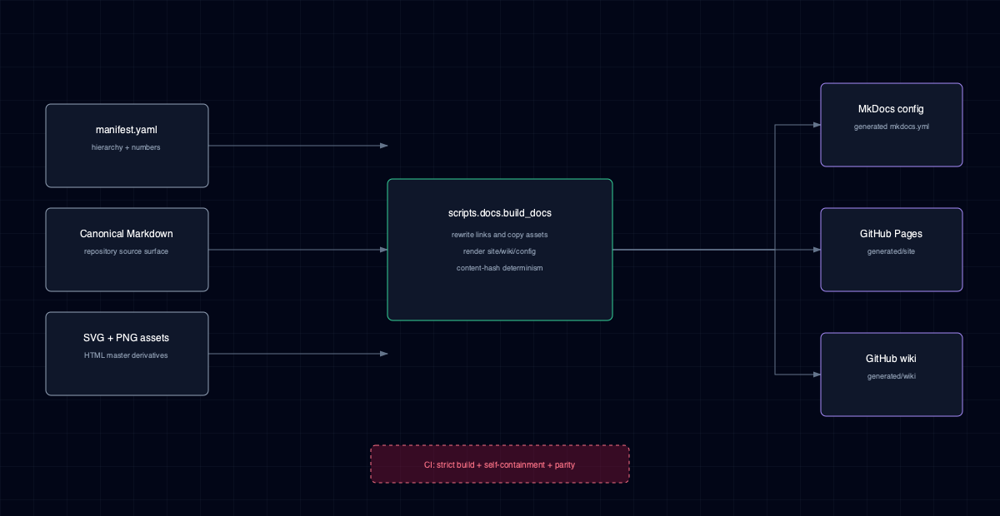

# 19. Contributing to NNx

Thanks for being interested in contributing. NNx is a small library; the goal is to keep it small, tested, and useful for the existing notebook consumers while inviting new ones.

## 1. Getting set up

```bash
git clone https://github.com/thekaveh/NNx.git
cd NNx
python -m pip install -r requirements-tools.txt
uv sync --all-extras --frozen
uv run pre-commit install       # optional but recommended
```

Diagram fallback generation also needs the native Cairo library: install it
with `brew install cairo` on macOS or `sudo apt-get install libcairo2` on
Debian/Ubuntu. CairoSVG itself is pinned in the `docs-publish` dependency group.

`--all-extras` installs every optional stack, including the `vision`,
`graph` and `plots` domains that `import nnx` never loads (FEAT-031). A
change to the core / extra split is checked against an installed wheel per
profile with `scripts/smoke_core_install.py` (CI's `installed-profiles` job;
run it from a clean environment outside the checkout with `PYTHONPATH`
unset).

Verify a clean baseline:

```bash
uv run pytest                          # full suite
uv run ruff check src/ tests/ examples/ scripts/  # lint
uv run ruff format --check src/ tests/ examples/ scripts/  # format check
uv run pyright --warnings              # type check
uv run python -m scripts.docs.extract_architecture_svg --check
uv run python -m scripts.docs.build_docs --check
uv run python -m scripts.docs.build_docs
uv run mkdocs build --strict           # generated docs (gates CI)
```

Repository Markdown is canonical. `docs/manifest.yaml` is the single page
inventory and each source H1 begins with its manifest number;
`scripts.docs.build_docs` generates ignored `mkdocs.yml`,
`generated/site`, and `generated/wiki` projections. Do not edit generated
outputs. A successful push to `main` publishes the same canonical content to
GitHub Pages and the repository wiki.



Diagram HTML masters first flow through
`scripts.docs.extract_architecture_svg`. The site selects SVG assets while the
repository and wiki select PNG fallbacks. CI checks canonical GitHub links,
tracked-file ownership, placeholder markers, stale API signatures and diagrams,
projection determinism, generated links, and a strict MkDocs build before
publication.

Useful env vars:

- `NNX_TQDM_DISABLE=1` silences the training progress bar. Set this in CI / non-TTY contexts, and in any test that drives `NNModel.train()` or `Trainer.train()` (the test suite's `conftest.py` already does this session-wide). Accepts `1` / `true` / `yes`, case-insensitive.

## 2. Workflow

1. **Open an issue first** for non-trivial changes — saves churn if the design is off. Tiny fixes can go straight to PR.
2. **Branch from `develop`.** Name branches descriptively (`fix/...`, `feat/...`, `docs/...`, `refactor/...`).
3. **Write tests.** Every PR that changes behavior should land with a focused test that fails on `main` and passes on the branch. The existing `tests/test_*_series.py` files (organized by audit pass) are good models.
4. **Keep PRs small.** One coherent change per PR is much easier to review than a sweeping mix.

## 3. What we care about

- **Strict back-compat for the existing notebook consumer.** Don't rename, remove, or restructure public APIs without a migration path. Preserve existing `runs/<id>/` artifacts; on-disk evolution requires a versioned, backward-compatible reader. New fields on params dataclasses must omit themselves from `.state()` when set to their defaults (preserves `run.id` hashes). See the omit-when-default regression tests in `tests/test_params_round_trip.py` (search for `test_nn_*_state_omits_*_when_*`) for the canonical pattern.
- **State / from_state round-trip.** Every params dataclass with a `state()` method must round-trip cleanly through `from_state(state())`. The contract is enforced by `tests/test_params_round_trip.py`.
- **Tests run on CPU and finish fast.** Keep new tests under a few seconds; use small TensorDataset fixtures from `tests/conftest.py`.
- **One-line update to `CHANGELOG.md` under `[Unreleased]`** for any user-visible change.

## 4. Style

- **Ruff** enforces formatting and a curated lint rule set (`E F W B I UP`). Run `ruff check --fix src/ tests/ examples/ scripts/` and `ruff format src/ tests/ examples/ scripts/` before pushing. Pre-commit handles both automatically when installed.
- **Type annotations** are encouraged on new code. We type-check with pyright (basic mode) in CI, with `--strict` planned over time.
- **Docstrings** on public functions / classes explain the *why* (constraints, edge cases) — not just the *what*. Multi-paragraph is fine when warranted.
- **Comments** explain non-obvious decisions, hidden constraints, or surprising behavior. Don't narrate code that's already self-documenting.

## 5. Testing

```bash
uv run pytest                          # full suite
uv run pytest tests/test_pass2_n_series.py::test_n7_evaluate_aggregates_across_batches
uv run pytest -k "graph"               # name filter
uv run pytest --cov=nnx --cov-report=term-missing  # with coverage
```

### 5.1. Feature combinations

`docs/feature-composition.yaml` records which feature **combinations** are
verified, unsupported or unverified, each with a stable scenario ID (`TC-01`,
`CR-03`, `MT-01`, ...), its profile and the pytest node ids that prove it;
[Feature composition](docs/feature-composition.md) renders it. When a change
moves a boundary — what two features do together, what is refused, a test
being renamed — review the scenario IDs it touches (`grep` the registry for the
feature or the test file) and update their `status`, `expected` and `tests`:

```bash
uv run python scripts/check_feature_composition.py --check                 # schema, unique IDs, every node id collected
uv run python scripts/check_feature_composition.py --check --run --report composition.json  # run and gate them
uv run python scripts/check_feature_composition.py --render                # refresh the committed page (no evidence)
```

An import, a skip, an xfail or a setup / teardown failure is never proof of a
combination: a verified scenario lists tests that assert its behaviour and pass
in every phase; an unsupported one links an executed negative test (or the
exact documented limitation). The CI `feature-composition` job fails when a
verified row fails or loses coverage.

The gate is strict only on the published profile's OS (Linux): there, `--run`
also fails when an extra in `evidence_profile.dependencies` is not installed,
so run it after `uv sync --all-extras`. Elsewhere, rows needing a missing extra
are simply not judged.

Tests live under `tests/`. The `conftest.py` registers a handful of hygiene fixtures (session-wide NNX_TQDM_DISABLE, a per-test env_snapshot cache reset, and a dynamo-dispatch skip guard); otherwise it's intentionally minimal. Add shared fixtures there when boilerplate repeats across multiple tests, not preemptively.

## 6. Submitting a PR

- Push to your fork and open a PR against `develop`.
- Fill in the PR template (Summary / Test plan).
- Wait for CI to go green (lint + format + tests + mkdocs on Python 3.10 through 3.14).
- Address review comments by pushing new commits — we squash on merge.

## 7. Releases

NNx uses [release-please](https://github.com/googleapis/release-please-action) for automated version bumps, changelog updates, and tagging. Contributors don't touch versions or tags — just write a [Conventional Commit](https://www.conventionalcommits.org/)-style PR title (`feat:`, `fix:`, `chore:`, `docs:`, etc.) and add a one-line entry under `[Unreleased]` in `CHANGELOG.md` for any user-visible change.

The end-to-end flow:

1. Every merge to `main` updates a long-lived "Release" PR maintained by `release-please.yml`. The PR accumulates the next version + `CHANGELOG.md` diff based on the conventional-commit types since the last tag. Pre-1.0, `feat:` triggers a minor bump (`0.X.0`); `fix:` and most other types trigger a patch bump (`0.X.Y`).
   The Release PR needs no hand-made finalize commit. release-please itself bumps the version in `pyproject.toml` (its Python updater) and on the lines marked `x-release-please-version`: the `__version__` fallback in `src/nnx/__init__.py` and the `nnx.__version__` line of `docs/api.md`, so the API-reference check renders the same version from the installed metadata. The workflow then runs `scripts/release/finalize_changelog.py`, which moves the curated `[Unreleased]` notes under the new version heading in place of the generated commit list (leaving `[Unreleased]` empty), and commits it with the lock refresh before dispatching the checks — through the GitHub API (`scripts/release/api_commit.py`), so GitHub signs the commit like release-please's own rather than leaving an unverified pushed commit, which the `main` ruleset can hold for an approving review; when the release is created it replaces the draft release's generated body with that curated section. Keep `[Unreleased]` curated: it becomes the release notes. A change to `[Unreleased]` that reaches `main` only through hidden commit types (`docs:`, `chore:`, `test:`) does not refresh the Release PR until the next visible one.
2. A maintainer reviews and merges the Release PR when ready to ship. Release Please explicitly dispatches the required CI and security checks for its managed branch, then creates the tag and draft release and dispatches the top-level `release.yml` workflow with the immutable release commit and tag.
3. `release.yml` verifies the Release Please commit belongs to `main`, runs the full test matrix, builds the package, publishes through PyPI trusted publishing (gated by the `pypi` GitHub Environment's approval rule), and verifies `pip install thekaveh-nnx==X.Y.Z` from a clean environment. Keeping trusted publishing in this top-level workflow ensures its OIDC token and package attestations carry the same PyPI-authorized workflow identity.

The `[project]` version is intentionally static and managed by release-please. **Do not distribute wheels or sdists built from an untagged commit:** after development resumes, such an artifact can contain code newer than the release while still carrying the last release number. Use editable installs for local source work. Distributable artifacts must come from Release Please's dispatched release workflow, which verifies tag/version agreement before publishing; direct tag pushes do not publish packages.

### 7.1. CI runner image

Every workflow job runs on one pinned GitHub-hosted image, `ubuntu-26.04` (`tests/test_ci_runner_image.py` checks it), never on a moving label such as `ubuntu-latest`, which GitHub re-points to new Ubuntu releases without a change in this repository. Moving to a new image is a deliberate pull request: change every `runs-on` and the test's `RUNNER` together, let that pull request's CI run on the new image (plus the release scripts — `scripts/release/finalize_changelog.py` runs on the image's system `python3`), and note the result. apt steps carry their own short `timeout-minutes`, so a package-mirror stall fails fast instead of consuming the job's budget.

## 8. Things we won't merge

- Changes that break on-disk format compatibility without a versioned reader.
- Public API renames without a deprecation shim and a `__getattr__` alias for at least one minor version.
- Code without tests.
- Dependencies added to `[project.dependencies]` (the core deps list) when they could go under `[project.optional-dependencies]` instead.

## 9. License

By contributing you agree that your contribution will be licensed under the [Apache License 2.0](LICENSE).
