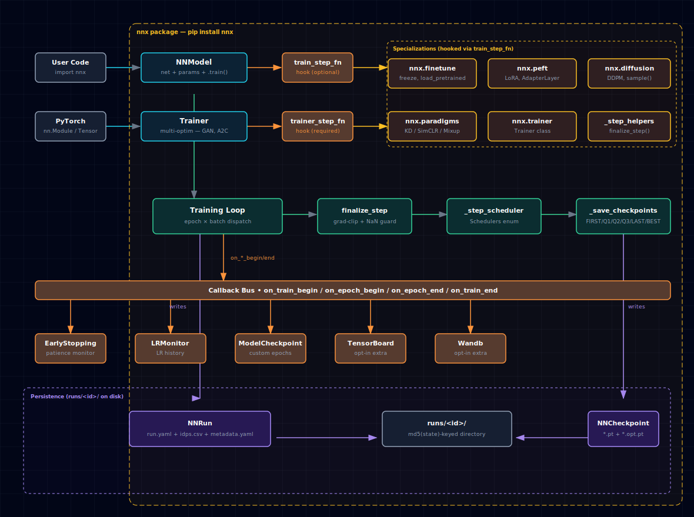

# NNx

Lightweight PyTorch training / eval / visualization toolkit. First-class support for graph neural networks (GCN / GraphSAGE / GAT). Originally extracted from `thekaveh/ml` to underpin training loops, checkpointing, and result visualization across notebook-based experiments; now standalone.

## 1. Overview

NNx owns the boilerplate around supervised training so you can focus on the model: it builds the network from frozen-dataclass configs, runs the train / eval / predict loop, manages checkpoints under a content-addressed `runs/<id>/` directory, dispatches a documented Callback lifecycle, and exposes pluggable extension points for fine-tuning, multi-optimizer training, diffusion, alternative training paradigms, and parameter-efficient fine-tuning.

### 1.1. Architecture



The diagram is generated via the `architecture-diagram` skill. A standalone interactive copy lives at [`docs/architecture.html`](docs/architecture.html); the embedded SVG above mirrors its content.

**Reading the diagram top-to-bottom (summary):**

1. **User code** instantiates **`NNModel`** (supervised) or **`Trainer`** (multi-optimizer for GAN / actor-critic).
2. Both expose the **`train_step_fn` / `trainer_step_fn`** hook — the orange bus through which the **Specialization subpackages** (`finetune`, `peft`, `diffusion`, `paradigms`, `trainer`, plus the shared `_step_helpers`) plug into the loop.
3. The **Training-loop internals** run `_step_scheduler` and `_save_checkpoints` each batch / epoch; paradigm/diffusion step factories additionally route through `finalize_step` (NaN guard + grad-clip).
4. The **Callback bus** fires `on_train_begin / on_epoch_begin / on_epoch_end / on_train_end` to every registered listener (`EarlyStopping`, `LRMonitor`, `ModelCheckpoint`, `TensorBoardCallback`, `WandbCallback`).
5. **`NNRun`** and **`NNCheckpoint`** write to **`runs/<id>/`** atomically after every epoch.

See [docs/concepts.md §1](docs/concepts.md#1-architecture) for the full 8-layer breakdown.

### 1.2. Capabilities at a glance

- **Generic training loop** — callbacks, early stopping, schedulers (`Schedulers` enum: `REDUCE_LR_ON_PLATEAU` / `STEP` / `COSINE_ANNEALING` / `ONE_CYCLE` / `LINEAR_WARMUP_DECAY`), AMP, gradient clipping, gradient accumulation, seeded reproducibility, custom metrics.
- **Content-addressed persistence** — `NNRun` saves `run.yaml` + `idps.csv` + `metadata.yaml` under `runs/<id>/` (where `id` is the md5 of `state()`); incremental writes after every epoch survive `KeyboardInterrupt`. `NNCheckpoint` saves at six tags (FIRST / Q1 / Q2 / Q3 / LAST / BEST) with optimizer-state `.opt.pt` sidecars for warm-resume.
- **`train_step_fn` hook** — swap the per-batch supervised step for any user-supplied function. Unblocks autoencoder / VAE / link-prediction / recommendation / diffusion / KD / SimCLR / Mixup / CutMix paradigms without modifying NNx internals.
- **Fine-tuning (transfer learning)** — `nnx.finetune.{freeze, unfreeze, load_pretrained, NNParamGroupSpec, build_param_groups}` plus `NNModel.{freeze, unfreeze, export_state_dict}`. Glob-pattern layer freezing, external state-dict loading with optional key remapping, per-layer-group learning rates via `NNOptimParams.param_groups`.
- **Multi-optimizer `Trainer`** — `nnx.trainer.Trainer` parallels `NNModel.train()` for scenarios that need disjoint optimizers (GAN G/D, actor-critic). Accepts a name-keyed dict of `NNOptimParams`; each entry's `NNParamGroupSpec` scopes the optimizer under strict-partition semantics.
- **Diffusion (DDPM)** — `nnx.diffusion.{NoiseSchedulers, DiffusionMLP, diffusion_train_step_factory, sample}`. LINEAR / COSINE noise schedules, a small conditional MLP denoiser, a DDPM-style training step factory that plugs into the `train_step_fn` hook, and a reverse-diffusion sampler.
- **Training paradigms** — `nnx.paradigms.{kd, simclr, mixup, cutmix}_train_step_factory` plus `born_again_train` (iterated self-distillation across G generations, each one's model becomes the next one's frozen teacher via the KD factory). Hinton-style knowledge distillation (teacher frozen, soft+hard loss mix), SimCLR contrastive (NT-Xent loss exposed), Mixup batch augmentation (any shape), CutMix batch augmentation (4D images). All share an internal `_step_helpers.finalize_step` for grad-clip + NaN guard.
- **Parameter-efficient fine-tuning (PEFT) — LoRA + adapters** — `nnx.peft.{LoRALinear, apply_lora_to, save_lora_weights, load_lora_weights, AdapterLayer}`. LoRA wraps `nn.Linear` submodules in-place with a frozen base + trainable low-rank residual (B is zero-initialized so output at step 0 equals the pretrained behavior). `save_lora_weights` persists only the lora_A/B matrices.
- **Networks** — `FeedFwdNN` (vision / tabular) and `GraphConvNN` / `GraphSageNN` / `GraphAttNN` (all built on the shared `GraphNNBase` so they differ only in their PyG layer constructor).
- **Datasets** — `NNDataset` (torchvision `VisionDataset` wrapper), `NNGraphDataset` (PyG single-graph wrapper using `NeighborLoader`), `NNTabularDataset` (pandas DataFrame → train/val/test loaders).
- **Params** — frozen, kw-only, slotted dataclasses for every config knob: `NNParams`, `NNModelParams`, `NNTrainParams`, `NNOptimParams`, `NNSchedulerParams`, `NNTrainerParams`. Every params object round-trips through `state()` / `from_state()`. New fields omit themselves from `state()` when at their default so existing `run.id` hashes are preserved.
- **Enums-as-factories** — `Nets`, `Losses`, `Optims`, `Schedulers`, `Activations`, `Devices`, `Checkpoints`, `NoiseSchedulers`. Each enum value's `__call__` constructs the underlying object; adding a new option is a single-place change.
- **Callbacks** — `Callback` base class with `on_{train,epoch}_{begin,end}` hooks. Stock: `EarlyStopping`, `LRMonitor`, `ModelCheckpoint` (custom-epoch tags), `TensorBoardCallback` (opt-in via `nnx[tensorboard]`), `WandbCallback` (opt-in via `nnx[wandb]`). Legacy `Callable[[List[IDP]], None]` is still accepted.
- **Visualization** — `VisUtils` (and module-level aliases) returns Plotly `Figure` objects: `confusion_matrix`, `classification_report` (returns a DataFrame), `multi_line_plot`, `scatter_plot`, `two_dim_tsne_checkpoint_logits`.
- **Reproducibility** — `nnx.set_seed(seed, strict=False)` pins every RNG + cuDNN; `nnx.dataloader_worker_init_fn` for per-worker seeds; `NNTrainParams.seed` runs `set_seed` at `train()` entry.
- **ONNX export** — `NNModel.to_onnx(path, example_input)` exports the network via the legacy `torch.onnx.export` (no `onnxscript` dep needed).

## 2. Install

### 2.1. Runtime

```bash
pip install nnx                        # latest release from PyPI
```

Python 3.10+. Tested on 3.10 / 3.11 / 3.12. Examples in [examples/](examples/) are runnable on CPU.

### 2.2. Optional extras

```bash
pip install "nnx[tensorboard]"         # TensorBoardCallback
pip install "nnx[wandb]"               # WandbCallback
pip install "nnx[onnx]"                # NNModel.to_onnx validation tooling
pip install "nnx[docs]"                # mkdocs build (mkdocs-material + mkdocstrings)
```

For local development (editable install from a git checkout, including the test/lint toolchain), see [CONTRIBUTING.md §1](CONTRIBUTING.md#1-getting-set-up).

## 3. Quickstart

End-to-end CPU example — a tiny random-tensor classification run:

```python
import torch
from torch.utils.data import DataLoader, TensorDataset

from nnx import (
    NNModel, NNParams, NNModelParams, NNTrainParams,
    NNOptimParams, NNSchedulerParams,
    Activations, Devices, Losses, Nets, Optims,
    EarlyStopping,
)

# 1. Data
X_train, y_train = torch.randn(256, 8), torch.randint(0, 3, (256,))
X_val,   y_val   = torch.randn(64, 8),  torch.randint(0, 3, (64,))
train_loader = DataLoader(TensorDataset(X_train, y_train), batch_size=32, shuffle=True)
val_loader   = DataLoader(TensorDataset(X_val,   y_val),   batch_size=32)

# 2. Model
net_params   = NNParams(input_dim=8, output_dim=3, hidden_dims=[32, 16],
                        dropout_prob=0.1, activation=Activations.RELU)
model_params = NNModelParams(net=Nets.FEED_FWD, device=Devices.CPU,
                             loss=Losses.CROSS_ENTROPY)
model = NNModel(net_params=net_params, params=model_params)

# 3. Train
train_params = NNTrainParams(
    n_epochs=10,
    train_loader=train_loader,
    val_loader=val_loader,
    optim=NNOptimParams(name=Optims.ADAM, max_lr=1e-2,
                        momentum=(0.9, 0.999), weight_decay=5e-5),
    scheduler=NNSchedulerParams(min_lr=1e-7, factor=0.5,
                                patience=3, cooldown=1, threshold=1e-3),
)
run = model.train(params=train_params, callbacks=[EarlyStopping(patience=5)])

# 4. Use it
print(f"trained {len(run.idps)} iterations; saved under runs/{run.id}/")
logits, classes = model.predict(X=X_val.numpy())  # returns PredictResult(logits=..., classes=...)
```

## 4. Advanced patterns

### 4.1. Switching networks

Change the `Nets` enum value passed to `NNModelParams`; NNModel constructs the underlying network for you:

```python
NNModelParams(net=Nets.GRAPH_CONV,  device=Devices.CPU, loss=Losses.CROSS_ENTROPY)
NNModelParams(net=Nets.GRAPH_SAGE,  device=Devices.CPU, loss=Losses.CROSS_ENTROPY)
NNModelParams(net=Nets.GRAPH_ATT,   device=Devices.CPU, loss=Losses.CROSS_ENTROPY)
# Then pass NNParams(..., n_heads=4) for GRAPH_ATT.
# Use NNGraphDataset (PyG NeighborLoader-backed) to feed batches.
```

See [examples/](examples/) for runnable end-to-end scripts.

### 4.2. Reproducibility

```python
from nnx import set_seed, dataloader_worker_init_fn
set_seed(42)                                        # pins torch / numpy / python / cudnn
DataLoader(..., worker_init_fn=dataloader_worker_init_fn)
NNTrainParams(seed=42, ...)                         # pins again at train() entry
```

### 4.3. Warm-resume training

```python
run = model.train(params=NNTrainParams(n_epochs=10, ...))

# Build a fresh NNModel and continue from run's LAST checkpoint
# (optimizer state preserved via .opt.pt sidecar):
NNModel(net_params=..., params=...).train(params=NNTrainParams(
    n_epochs=10,
    resume_from_run_id=run.id,
    resume_from_checkpoint="last",   # or "best" / "first" / "q1" / "q2" / "q3"
    ...
))
```

> **Scope:** Warm-resume is supported for the supervised `NNModel.train()` path. `nnx.trainer.Trainer` (multi-optimizer) does not yet ship `.opt.<name>.pt` per-optimizer sidecars; that's a planned follow-up.

### 4.4. Custom metrics

```python
NNTrainParams(
    ...,
    extra_metrics={
        "my_metric": lambda y, y_hat: float((y == y_hat).mean()),
    },
)
# Available on idp.train_edp.extra / idp.val_edp.extra and survives NNRun.load.
```

### 4.5. Visualization

```python
from nnx import VisUtils
fig = VisUtils.confusion_matrix(y_true, y_pred, class_names=["a","b","c"])
fig.show()
df = VisUtils.classification_report(y_true, y_pred)  # DataFrame
```

### 4.6. Auto device detection

```python
from nnx import Devices
NNModelParams(net=Nets.FEED_FWD, device=Devices.get(), loss=Losses.CROSS_ENTROPY)
# Devices.get() picks MPS (Apple) > CUDA > CPU.
```

### 4.7. Mixed precision (CUDA)

```python
NNModelParams(..., mixed_precision=True)   # silently no-op on CPU/MPS
```

### 4.8. Scheduler choices

By default the scheduler is `ReduceLROnPlateau` driven by the params dataclass. Pass `kind=` to switch:

```python
from nnx import Schedulers
NNSchedulerParams(..., kind=Schedulers.COSINE_ANNEALING, T_max=100)
# Or: STEP, ONE_CYCLE, LINEAR_WARMUP_DECAY
```

### 4.9. Loading a run

```python
from nnx import NNRun, NNCheckpoint, Checkpoints
run  = NNRun.load(id="<md5>")                              # rehydrate idps + params
ckpt = NNCheckpoint.load(run=run.id, type=Checkpoints.BEST)
model = NNModel.from_checkpoint(checkpoint=ckpt)
```

## 5. Documentation

### 5.1. Conceptual + reference

- [Concepts](docs/concepts.md) — architecture deep-dive, persistence layout, callback protocol, every specialization in detail. Read this when you want to understand how the pieces fit together (callbacks, params hashing, train_step_fn hook, multi-optim Trainer, paradigms, PEFT).
- [Quickstart](docs/quickstart.md) — paste-runnable example with variations. Read this when you want to copy a working snippet and iterate from there.
- [API reference](docs/api.md) — auto-generated from docstrings via mkdocstrings. Read this when you want the canonical signature / docstring for a public symbol.
- [Architecture diagram](docs/architecture.html) — standalone interactive HTML version of the diagram in §1.1. Read this when the embedded SVG is hard to follow and you want to hover for labels.

### 5.2. Workflow + history

- [Examples catalog](examples/README.md) — ordered tour of the 10 runnable scripts under `examples/`, grouped foundational → specialized. Start here if you'd rather read a working script than the concepts doc.
- [Contributing](CONTRIBUTING.md) — setup, back-compat invariants, test policy, the omit-when-default rule for params, what we will and won't merge.
- [Changelog](CHANGELOG.md) — release history (Keep-a-Changelog format), back-compat migration notes, and on-disk run.id hash shifts when they occur.

## 6. Project

### 6.1. Status

Alpha. API is stable for the existing `thekaveh/ml` notebook consumer; pre-1.0 means we'll fix obvious bugs (see [CHANGELOG](CHANGELOG.md)) without renaming public APIs unless they're broken in ways notebooks can't work around.

### 6.2. Contributing

Bug reports and PRs welcome via GitHub issues. See [CONTRIBUTING.md](CONTRIBUTING.md) for the full setup + style guide. Running locally:

```bash
pytest                                       # full suite (~5s)
pytest tests/test_callbacks.py::test_lr_monitor_records_history  # one test
ruff check src/ tests/ examples/             # lint (gates CI)
ruff format --check src/ tests/ examples/    # format (gates CI)
mkdocs build --strict                        # docs (gates CI)
```

### 6.3. License

MIT. See [LICENSE](LICENSE).
