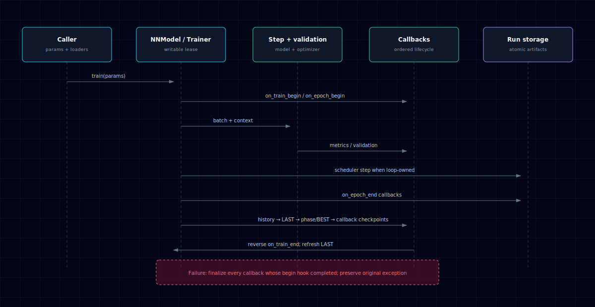
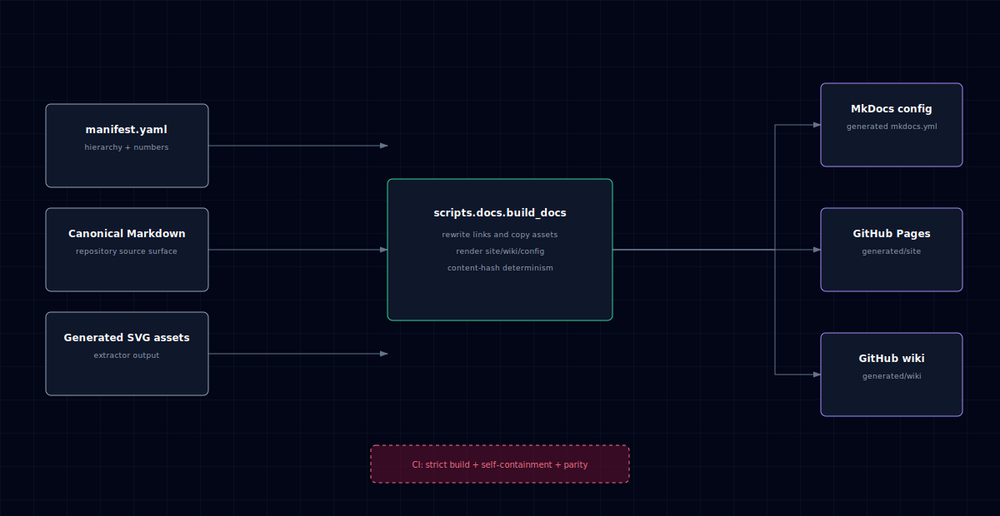

# Architecture

## 1. Package and lifecycle overview

NNx is organized around two public entry points (`NNModel` / `Trainer`), a
training-hook family (`train_step_fn`, `eval_step_fn`, and
`trainer_step_fn`), and content-addressed persistence under `runs/<id>/`.
Hook-producing modules inject behavior into the orchestrators; model transforms,
exporters, inference helpers, and diagnostics compose around them. The training
loop owns callback dispatch, once-per-epoch scheduler updates, phase checkpoint
cadence, and incremental `NNRun` persistence.

See [Concepts §1](concepts.md#1-architecture) for the full written breakdown.

## 2. Lifecycle order

For each successfully started training run, NNx calls `on_train_begin`, then
dispatches epoch and batch work. A completed epoch aggregates validation through
the built-in path or `eval_step_fn`, updates the scheduler once, and dispatches
`on_epoch_end`. Durable state then commits in order: run history, LAST,
phase/BEST, and deferred callback checkpoints. Finalization calls `on_train_end`
in reverse callback order. Both `NNModel` and `Trainer` refresh LAST after
finalization so callback mutations and topology-transform metadata are present
in the persisted checkpoint.

On failure, callbacks whose begin hook completed are still finalized. Every
cleanup hook is attempted; cleanup errors do not mask an exception already
raised by training. A failed LAST commit rolls history back; failures after LAST
retain the durable history/checkpoint pair. On load, history newer than LAST is
truncated, while an empty or corrupt LAST is rejected rather than treated as a
request to erase history.

## 3. Documentation publication

Canonical Markdown and generated SVG assets are inputs to
`scripts.docs.build_docs`; diagram HTML masters first flow through
`scripts.docs.extract_architecture_svg`. `docs/manifest.yaml` is the sole page
inventory. The builder then emits `mkdocs.yml`, `generated/site`, and
`generated/wiki`. CI rejects stale diagrams, broken local links,
non-deterministic projections, or a strict MkDocs failure before Pages or the
wiki can publish from `main`.
