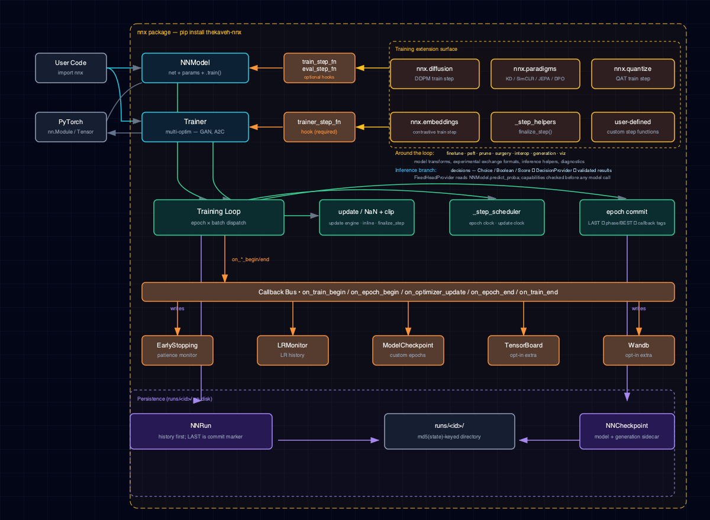
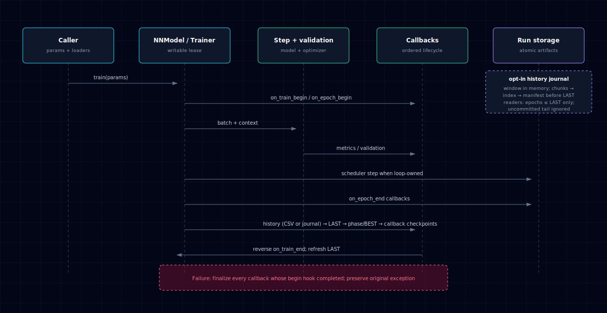

# 16. Architecture

## 1. Package and lifecycle overview

NNx is organized around two public entry points (`NNModel` / `Trainer`), a
training-hook family (`train_step_fn`, `eval_step_fn`, and
`trainer_step_fn`), and content-addressed persistence under `runs/<id>/`.
Hook-producing modules inject behavior into the orchestrators; model transforms,
exporters, inference helpers, and diagnostics compose around them. The
inference branch, `nnx.decisions`, sits beside the training path: typed
questions go to a `DecisionProvider` (for a trained classifier,
`FixedHeadProvider` over `NNModel.predict_proba`) and come back as validated
results ([Typed decisions](decisions.md)). The training
loop owns callback dispatch, scheduler updates (once per epoch by default; once
per committed optimizer update for a `clock="optimizer_update"` scheduler),
phase checkpoint cadence, and incremental `NNRun` persistence.

See [Concepts §1](concepts.md#1-architecture) for the full written breakdown.



## 2. Lifecycle order

For each successfully started training run, NNx calls `on_train_begin`, then
dispatches epoch and batch work. A completed epoch aggregates validation through
the built-in path or `eval_step_fn`, updates each epoch-clock scheduler once,
and dispatches `on_epoch_end`. An `optimizer_update`-clock scheduler is stepped
instead right after each committed update of its optimizer — reported by the
update engine, by `default_train_step`, by `finalize_step` (the built-in
paradigm steps), or by a step function calling
`ctx.report_update(...)` — never per microbatch, masked window or skipped step;
an objective's `on_optimizer_update` callbacks see every optimizer's event of a
commit before any clock steps. A run that declares metrics or a named monitor also records the
whole-epoch training summary and the monitor's decision before the scheduler
update; that one decision drives the plateau scheduler, BEST and any
`EarlyStopping` given the same monitor
([Concepts §6.4](concepts.md#64-named-metrics-and-monitors)). In an objective
run the shared update engine accumulates each microbatch's loss terms and, at
the end of every update window, runs unscale → clip → step and dispatches
`on_optimizer_update` once per committed update — before the epoch's
validation and the commit order above
([Concepts §6.5](concepts.md#65-objectives-and-the-shared-update-engine)). Durable state then commits in order: run history, LAST,
phase/BEST, and deferred callback checkpoints. Finalization calls `on_train_end`
in reverse callback order. Both `NNModel` and `Trainer` refresh LAST after
finalization so callback mutations and topology-transform metadata are present
in the persisted checkpoint.

On failure, callbacks whose begin hook completed are still finalized. Every
cleanup hook is attempted; cleanup errors do not mask an exception already
raised by training. A failed LAST commit rolls history back; failures after LAST
retain the durable history/checkpoint pair. On load, history newer than LAST is
truncated, while an empty or corrupt LAST is rejected rather than treated as a
request to erase history. Each text file is replaced on its own through an owned
temporary file: a failed write leaves that destination's previous bytes and
removes its temporary, but the history files are not one multi-file
transaction, and a hard kill can still leave a stale temporary behind.

With an opt-in history journal (`history=HistoryJournal(...)`,
[Concepts §4.5](concepts.md#45-bounded-history-the-history-journal)) the
loop keeps a bounded window of records in memory, and the "run history" step
appends the epoch's records as immutable chunks, indexes them and publishes
the journal manifest — still before LAST, which stays the commit marker.
Readers show records up to LAST's epoch only, so a crash between the
manifest and LAST leaves an uncommitted tail that is ignored; a failed LAST
republishes the previous manifest. Callbacks see the window as `ctx.idps`
unless they declare `history_access = "full"`, and a continuation writes its
own run and chunk files, never its source's.



## 3. Single-node data parallelism (`nnx.distributed`)

`train(params, distributed=DDP())` (FEAT-030) runs inside the process group
`torchrun` started — NNx adds no runtime of its own:

```text
torchrun --standalone --nproc_per_node=2 train.py
   ├── rank 0 (writer) ── init_process_group() ── train_loader / validation_loader ── model.train(distributed=DDP()) ── shutdown()
   └── rank 1          ── init_process_group() ── train_loader / validation_loader ── model.train(distributed=DDP()) ── shutdown()
                                  (gloo on CPU, nccl with one GPU per rank)
```

**Teardown.** `nnx.distributed.shutdown(timeout_seconds=60)` ends the
recipe: every rank meets at a teardown barrier, then the group is destroyed,
so no rank tears down its connections while a peer still uses them. The wait
is bounded (with Gloo; with NCCL on older torch, by the group's own timeout):
a rank that does not arrive in time makes the others raise `RuntimeError`
instead of blocking in the call. The group is then left for process exit, and
the process may still wait at exit until the missing rank arrives or the
group's timeout expires. Without a process group, or after a successful call,
it does nothing.

**Partitions.** `nnx.distributed.train_loader(dataset, batch_size, policy=, seed=)`
deals each epoch's permutation (seeded by `seed + epoch`) to the ranks after
padding (`"pad"` repeats leading rows) or dropping (`"drop"`) the tail, so every
rank takes the same number of steps; a mismatch fails on every rank before the
epoch. `validation_loader(dataset, batch_size)` shards rows `rank::world`
*unpadded*: every row id is scored exactly once, a rank may have none, and the
validation loop runs no collective.

**One update.** Per microbatch:

```text
forward + backward through DDP  (no_sync until the window's last microbatch)
   │   loss numerator only; finiteness agreed on every rank before backward
   ▼
window end:  W = all_reduce(sum of the ranks' loss denominators)
   │   W == 0 for a task model → skip the update on every rank
   ▼
grad = DDP average × world_size / W        (an additive loss: × world_size)
   ▼
clip → optimizer.step()  — identical parameters on every rank
```

so each committed update equals one process training on the union of the
ranks' batches, unequal valid counts included.

**Records and decisions.** Each batch's outputs, targets and loss terms are
gathered and scored the same way on every rank; validation gathers each
rank's scored shard once. Records are therefore global and identical on every
rank — monitors, `EarlyStopping`, BEST and the plateau scheduler decide alike,
and every rank returns the same `NNRun` (id, records and the writer's
provenance). Each step's gather carries the batch's outputs and targets, and
validation gathers every scored output once: sized for supervised models.

**One writer.** Only the writer rank (`DDP(writer_rank=0)`) holds the run lease
and writes history, LAST / BEST / phase checkpoints, deferred callback
checkpoints and the provenance attempt; each epoch's commit is agreed, so a
failed write stops every rank. Checkpoints hold the canonical module's keys
(DDP wraps `model.net` per fit and is never assigned to it) plus the world
size, the partitions and every rank's RNG streams; a resume with the same
world size and partition restores them all, any other fails before anything
is restored (so does a single-process stateful resume of a distributed
checkpoint; `resume_mode="weights_only"` starts fresh from its weights).
Resume, component restore and epoch-end callback failures are agreed too;
anything else failing on one rank only ends through the process group's
timeout and `torchrun` stopping the other ranks.

```text
            writer rank                        other ranks
lease       runs/.leases/<id>.lock             —
history     runs/<id>/idps.csv, run.yaml       in memory (same records)
checkpoint  LAST / BEST / phase / deferred     —
callbacks   "all" + "writer" + writer_only()   "all"
```

**Callbacks** declare their rank behaviour (`Callback.distributed`): `"all"`
(`EarlyStopping`, `LRMonitor`) run everywhere and must not write; `"writer"`
(`ModelCheckpoint`, plain function callbacks) run on the writer only and may
not carry checkpointed component state. `TensorBoardCallback` and
`WandbCallback` write when constructed, so a borrowed instance is refused;
`nnx.distributed.writer_only(lambda: TensorBoardCallback(...))` builds one on
the writer alone. A callback that declares nothing is refused before training,
on every rank.

Exactness holds for deterministic forwards: batch normalization is refused
(its running statistics would differ per rank), and dropout draws each rank's
own stream, matching one process only in distribution.

Out of scope: multi-node or elastic runs, FSDP / DeepSpeed, mixed precision,
`compile=`, custom train or validation steps and objectives, history journals,
graph neighbour sampling. See
[`examples/ddp_supervised.py`](https://github.com/thekaveh/NNx/blob/main/examples/ddp_supervised.py).

